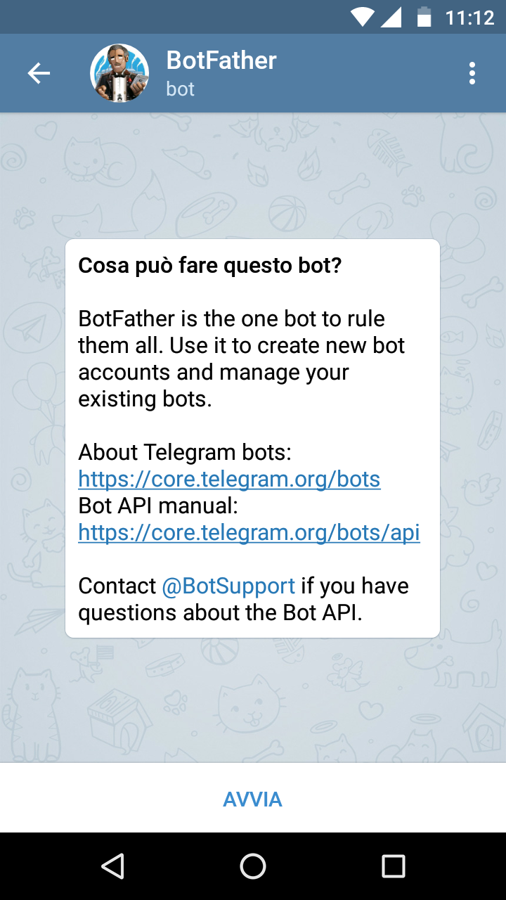
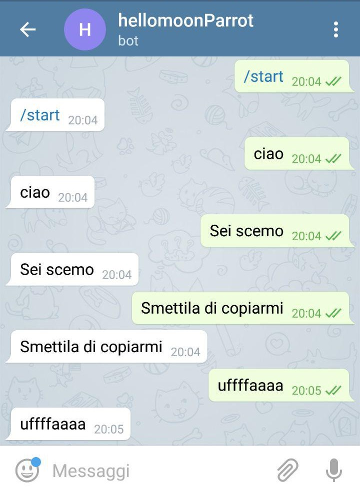
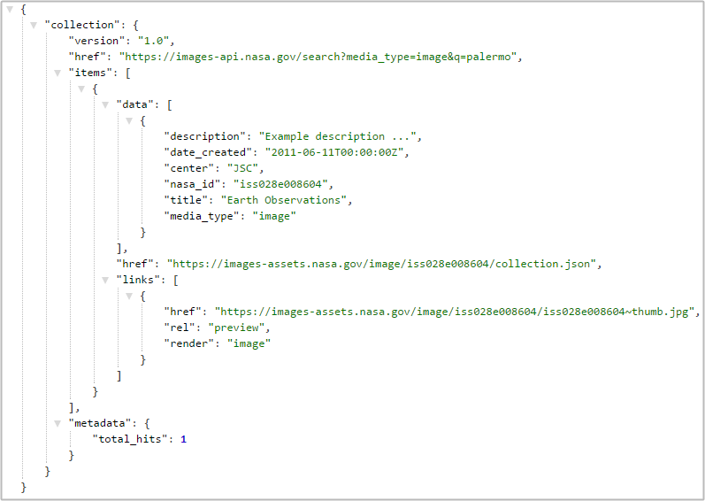
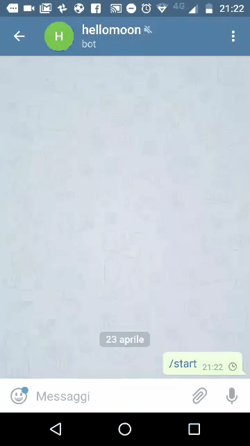

# Come realizzare un bot telegram

## Intro

**Sono l'ultimo dei primi**, ci sono già tanti *tutorial* con lo stesso titolo, però voglio condividere la mia piccola esperienza, perché mi sembra una modalità comoda e didattica.
Mostrerò come creare un bot Telegram basato su un `microservice`.

Un bot - in questo caso un **chat bot** - è un utente con cui chattare, un po' diverso dai soliti perché fatto di codice. Un po' come se dialogassimo con un robot.

**[Telegram](https://telegram.org/)** è una bella piattaforma di *istant messaging* che la possibilità di creare dei *chat bot* e di interagire con questi.

Per definire un microservizio userò le parole di [Martin Fowler](https://hyp.is/-RlwHihIEeesx780tEKQLw/martinfowler.com/articles/microservices.html):
> Lo stile architetturale a microservizi è un approccio allo sviluppo di una singola applicazione come insieme di piccoli servizi, ciascuno dei quali viene eseguito da un proprio processo e comunica con un meccanismo snello, spesso una HTTP API.

## Bot "pappagallo" in Python

Il bot "pappagallo" fa una cosa sola: risponde ai messaggi che riceve, con le stesse parole che ha ricevuto.

È una cosa che sembra inutile, in realtà è un fondamentale punto di partenza. Perché il *core* di un *chat bot* è fare in modo che riceva dei messaggi e ci faccia qualcosa.

La prima cosa da fare è installare Telegram e usare proprio un bot ([@botfather](https://t.me/botfather)), avviarlo e creare un nuovo bot.



Non entro nei dettagli, è semplice e trovate molti articoli sul tema.
Creato il bot, annotate da qualche parte i relativi **nome** e **token**.

Il prossimo passo è quello di creare il microservizio. Useremo una gran bella piattaforma: [hook.io](https://hook.io/).

Questi gli step:

- registratevi;
- create un [nuovo microservizio](https://hook.io/new) e dategli un nome. Ogni microservizio è qui chiamato `Hook`;
- scegliete python come linguaggio;


- inserite il codice sottostante e salvate il microservizio.

```python
import requests

# raccolgo nella variabile `testo` ciò che gli utenti scriveranno in chat al bot
testo=Hook['params']['message']['text']

# raccolgo la chat ID
chatID=Hook['params']['message']['chat']['id']

# imposto l'URL per inviare i messaggi indietro al bot
URL='https://api.telegram.org/bot' + Hook['env']['hellomoonparrot_bot_key'] + '/sendMessage'

richiesta=requests.get(URL,verify=False,data={'chat_id':chatID,'text':testo})
```

Il passo successivo è quello di dire al bot di usare il microservizio appena creato. Per farlo chiamate (anche via browser) questo URL inserendo i vostri dati:

    https://api.telegram.org/bot<TOKEN>/setWebhook?url=https://hook.io/<hook-user>/<hook-name>

- `<TOKEN>` è il token del vostro bot;
- `<hook-user>` è il nome utente creato su hook.io;
- `<hook-name>` è il nome del microservizio che avete creato.

Una volta lanciato l'URL, se tutto va bene, avrete in risposta qualcosa come:

    {"ok":true,"result":true,"description":"Webhook was set"}

Questo è un punto chiave: impostando un *Webhook* stiamo dicendo al bot che abbiamo creato di reindirizzare tutto ciò che viene inviato in chat, verso il microservizio che abbiamo creato.

Nel codice del microservizio queste le parti chiave:

- viene importato il modulo python, che consentirà di fare "parlare" il chat bot con gli utenti, facendo delle chiamate in HTTP;
- tutti i parametri HTTP in ingresso - in questo caso i messaggi di chat - vengono raccolti nell'oggetto `Hook.params`, che in python è in `Hook['params']` (il linguaggio consigliato di hook.io è javascript);
- raccogliamo in una variabile il testo che il microservizio riceve;
- in un'altra l'ID della chat in corso. Ogni utente avrà con il bot la sua chatID;
- inviamo indietro alla chatID da cui abbiamo ricevuto il messaggio, la copia dello stesso, tramite il modulo `requests` di python.

Non vi resta che aprire il bot che avete creato e chattare con lui. Io ne ho creato uno di test e potete provarlo qui: [@hellomoonParrot_bot](https://t.me/hellomoonParrot_bot).

.

Tutto questo non è straordinario??

## "hellomoon" bot, un bot basato sulle API della NASA

Alcuni giorni fa la **NASA** ha reso pubblico un bel motore di ricerca che consente di cercare nel suo fantastico archivio multimediale: https://images.nasa.gov

L'aspetto molto interessante è che è possibile usarlo anche tramite [**API**](https://images.nasa.gov/docs/images.nasa.gov_api_docs.pdf) e quindi si presta molto bene a creare un bot che data una (o più) parola chiave, mi mostra le immagini correlate trovate in questo catalogo.

Se voglio ad esempio cercare soltanto tra le immagini la stringa "palermo", interrogherò le API con [questo URL](https://images-api.nasa.gov/search?media_type=image&q=palermo):

    https://images-api.nasa.gov/search?media_type=image&q=palermo

La NASA risponde in `JSON`:



Per creare questo bot non è necessario fare molto di più di quanto fatto per il "pappagallo":

- studiare un po' le API della NASA, fare qualche query di test e leggerne gli output;
- creare un bot Telegram;
- creare un microservizio in python a cui aggiungere
 - un modulo per leggere dati in formato JSON;
 - il metedo delle API di Telegram per [inviare foto](https://core.telegram.org/bots/api#sendphoto).

Il bot è questo - [@hellomoonbot](https://t.me/hellomoonbot) - e qui sotto le vedete in azione.




## Considerazioni finali

Non avrei mai scritto questo post, senza prima aver letto [questo bel post](https://unnikked.ga/how-to-easily-build-a-telegram-bot-with-hook-io-4c144c4abd96) di Nicola Malizia, che ringrazio molto.

Diffidate sempre un po' dalle guide che mostrano come realizzare qualcosa con poco sforzo, poca conoscenza di dominio e senza spese. Quindi fatelo anche con questo tutorial.
Ho usato ad esempio la versione free di **hook.io** che è limitata a 1000 richieste mensili: sono poche per realizzare qualcosa che (si spera) verrà usato da molti utenti. La soluzione è pagare o realizzare un bot in totale autonomia (quindi ci vuole una competenza più "larga").

La gran parte dei bot Telegram sono poco utili. Spesso infatti (come in questo caso), si tratta di poco più di motori di query che restituiscono un risultato all'utente, per i quali sarebbe preferibile un minisito basato su php, python, ecc. e con una interfaccia che si adatti al terminale usato.
Se può bastare un browser, è meglio non aggiungere una dipendenza da un'altra app.


Ciò che utile e "intelligente" dipende in ogni caso anche da noi.
Un po' perché è questione di gusti. Io ho un amico che impazziva per il bot dedicato a Jovanotti, che rimpiazzava tutte le 's' (e anche le 'z') con 'f' in tutte le risposte che dava.
Un po' perché oggi esistono eccellenti librerie e API di analisi (di testi, immagini, audio, video, ecc.), di machine learning, di  Natural language processing, di intelligenza artificiale che consentono di aggiungere molta intelligenza a una buona idea di bot e a una preparazione adeguata per usarle.

Questo tutorial è scritto per mettere soltanto un piede dentro questo spazio, tutto il resto sta a ognuno di noi.

### Letture consigliate

- [How to easily build a Telegram Bot with Hook.io](How to easily build a Telegram Bot with Hook.io);
- [Building a Chatbot using Telegram and Python](https://www.codementor.io/garethdwyer/building-a-telegram-bot-using-python-part-1-goi5fncay);
- [Bots: What you need to know](https://www.oreilly.com/ideas/bots-what-you-need-to-know);
- [Make a Twitter Bot in Python: Iterative Code Examples](https://jitp.commons.gc.cuny.edu/make-a-twitter-bot-in-python-iterative-code-examples/);
- [Microservices a definition of this new architectural term](https://martinfowler.com/articles/microservices.html).
